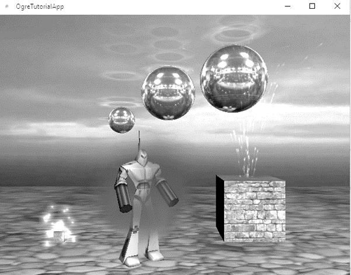
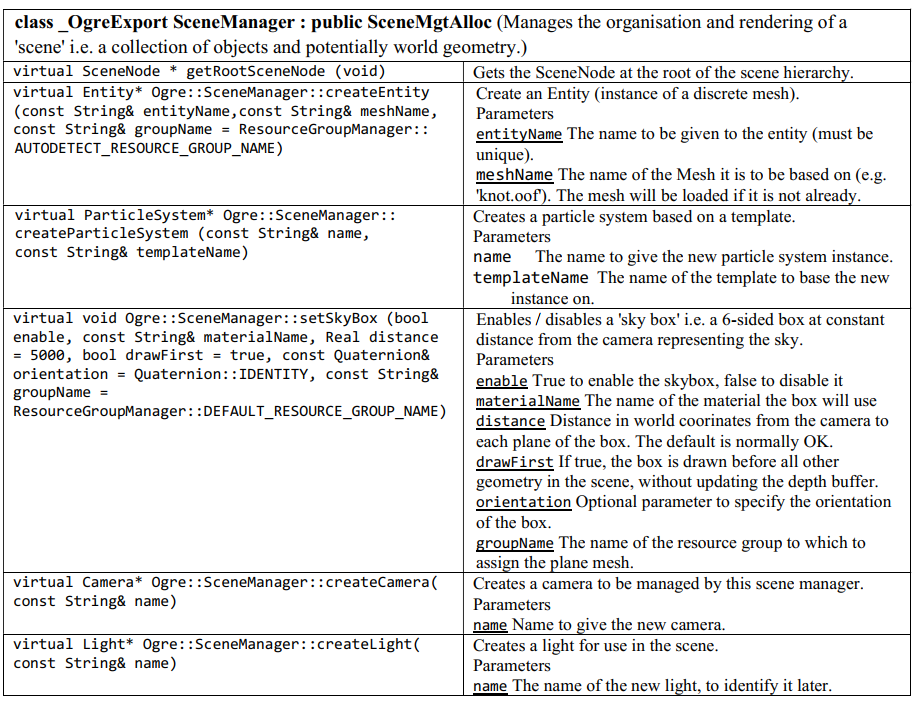
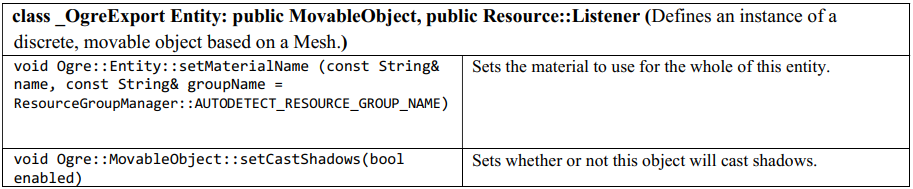
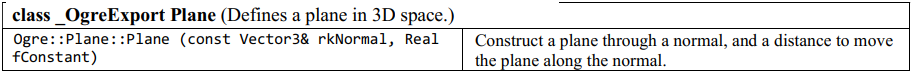
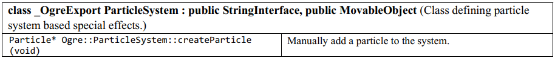
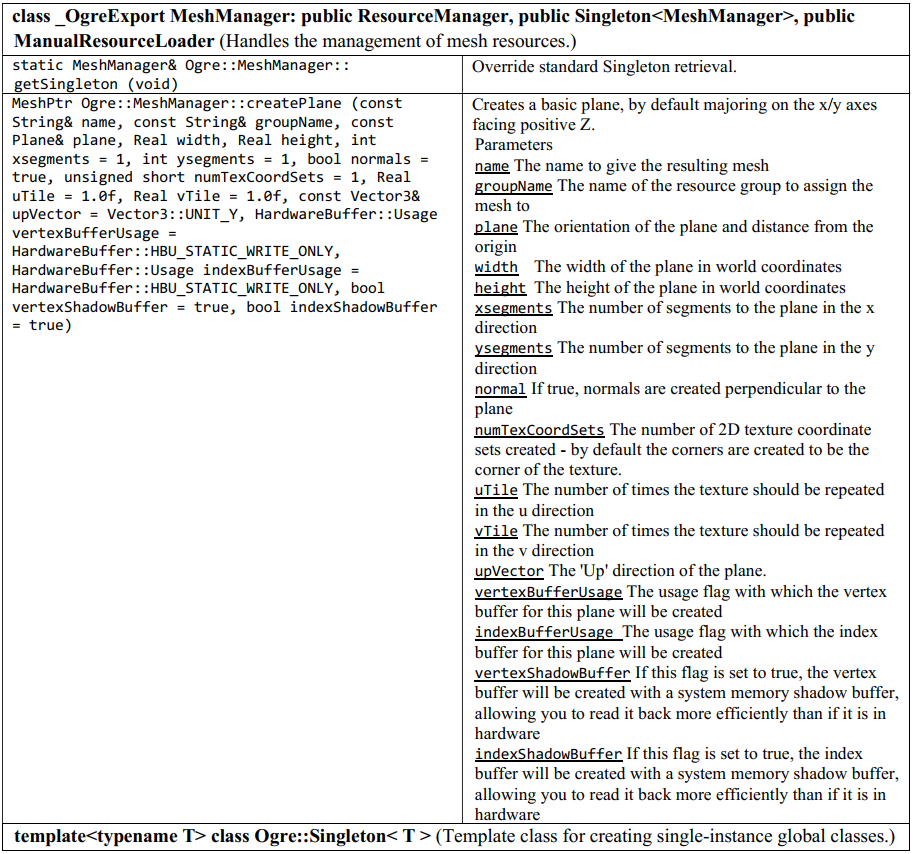

# my-Ogre3D

A program was developed on the Ogre engine. The program was implemented in the Visual Studio 2017 environment. For this environment, the previously compiled Ogre SDK version 1.11.4 was used. The final scene contains several simple geometric shapes and an imported model. Also, 4 effects were realized.

Analysis of the used code of the graphical engine of the imported model to understand the project's structure:

